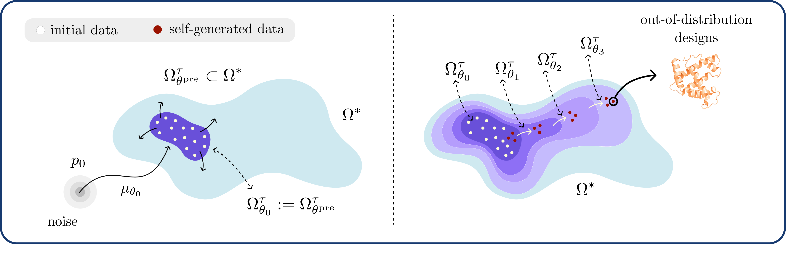

# Active Diffusion Models

Towards efficient mid-training and test-time discovery beyond the data via self-expansion.

<p align="center"></p>

## Peptide Problem Setup

The `peptides` problem setup models therapeutic peptide generation using a
discrete masked diffusion model (MDM) over SMILES tokens. Starting from the
pretrained PepTune MDM, we run an **uncertainty-based adaptation loop** that
self-expands the model beyond its pretraining distribution: at each iteration
the policy generates its own peptides, an uncertainty model scores how
*novel/underexplored* each one is, and the policy is fine-tuned to put more mass
on those high-uncertainty regions. Validity is assessed by parsing each
generated SMILES string as a well-formed peptide.

The peptide code lives under `src/` and is partially built upon
[TR2-D2 (Tang et al., 2025)](https://github.com/sophtang/TR2-D2) and 
[MDLM (Sahoo et al., 2023)](https://github.com/kuleshov-group/mdlm).

## Installation

Create and activate the conda environment:
```bash
conda env create -f src/environment.yml
conda activate actflow_pep
```

## Pretrained Weights

Download the pretrained MDM required for this experiment, originally from
[PepTune](https://arxiv.org/abs/2412.17780):

1. Download the PepTune pre-trained MDM and place it in `src/pretrained/`:
   https://drive.google.com/file/d/1oXGDpKLNF0KX0ZdOcl1NZj5Czk2lSFUn/view?usp=sharing

Paths are resolved relative to the repo, so no editing is needed. Fine-tuning
curves, checkpoints, and logs are written under `results/`, `checkpoints/`, and
`logs/` at the repo root (override with `--base_path` / `--save_path_dir`).

## The Uncertainty-Based Adaptation Algorithm

Adaptation is launched with `finetune_with_uncertainty.py`. It wraps the WDCE
fine-tuner in an **active-learning loop** (`active_learning_loop`) that alternates
between fine-tuning the policy and re-scoring its own samples:

For each of `--num_al_iterations` iterations:

1. **Fine-tune** the policy MDM on its self-generated replay buffer with the
   reward-tilted WDCE loss (`finetune`, or `finetune_continued_pretraining` for
   the uniform-reward baseline). The current reward shifts the importance
   weights so trajectories landing in high-reward regions are up-weighted.
2. **Sample** `--num_exploration_samples` peptides from the updated policy and
   measure validity.
3. **Score** the samples with the uncertainty reward (below) and update the
   uncertainty model's buffer with the new sequences.

### The uncertainty reward

The exploration signal comes from a **Gaussian-process (GP) uncertainty model**
(`gaussian_process.py`) built on top of the MDM's own backbone:

 * Each peptide is embedded with the MDM backbone (≈768-D). The GP places a
   kernel (`--gp_kernel`: cosine / rbf / linear) over these embeddings.
 * The reward for a sequence is its **GP posterior variance**, normalized to
   `[0, 1]`. Samples far from everything already in the buffer have high
   posterior variance → high reward → the loop is pulled toward unexplored
   regions of sequence space. As those regions get visited and added to the
   buffer, their uncertainty drops, so exploration keeps moving (an
   active-learning acquisition function).

### Reward modes (`--mode`)

 * `uncertainty_only` (default): reward = GP uncertainty. Pure exploration:
   the policy is pulled toward novel regions of sequence space.
 * `continued_pretraining`: uniform (constant) reward, no tilting. The model
   simply continues training on its own valid samples; serves as the
   recursion/self-training baseline.
 * `continued_pretraining_filtered`: same uniform-reward recursion as above, but
   with `--filter_invalid --gp_filter_invalid` so invalid peptides are dropped
   before they enter the trajectory and GP buffers, so the model trains only on
   valid, on-manifold samples.

## Run All Three Modes

```bash
sbatch scripts/run_all.slurm
```

### Arguments

#### Active learning loop

 * `--mode`: Reward mode: `uncertainty_only` or `continued_pretraining` (see
   above). Default: `uncertainty_only`.
 * `--num_al_iterations`: Number of active-learning iterations (fine-tune →
   sample → score → update)
 * `--alpha`: Reward temperature that scales the uncertainty reward tilt in the
   WDCE loss
 * `--initial_pool_size` / `--pool_refresh_fraction`: Size of the initial
   fine-tuning pool and the fraction refreshed with new samples each iteration.
 * `--save_every_n_iters`: How often to dump sequences and PCA plots.

#### Uncertainty model

 * `--gp_kernel`: GP kernel over backbone embeddings: `cosine` (direction-based,
   default), `rbf` (Euclidean), or `linear` (dot-product).
 * `--gp_lengthscale`: RBF lengthscale; pass `0` to auto-set it to the mean
   pairwise distance of the bootstrap embeddings.
 * `--gp_conditional_reward`: Use the within-batch conditional posterior variance
   so collapse self-penalizes (see above).
 * `--gp_buffer_mode` / `--gp_buffer_window`: How the GP buffer grows each
   iteration: `append` (cumulative, default), `replace` (refit on this
   iteration's samples), or `window` (rolling FIFO of size `--gp_buffer_window`).
 * `--gp_filter_invalid`: Drop sequences failing `analyzer.is_peptide` before
   they enter the uncertainty buffer (keeps the GP on-manifold).
 * `--noise_timestep` / `--n_noise_samples`: Optionally noise inputs to a
   diffusion timestep before embedding extraction and average over draws.

#### Fine-tuning / WDCE

 * `--learning_rate`: Fine-tuning learning rate. **Recommended**: match
   pre-training (`1e-4`); lower if you see overfitting.
 * `--num_epochs`: Fine-tuning epochs per AL iteration. Default: `50`.
 * `--wdce_num_replicates`: Replicates used to estimate the WDCE loss.
   **Recommended**: `16`.
 * `--total_num_steps`: Diffusion sampling steps. Default: `128`.
 * `--seq_length`: Maximum generated sequence token length. Default: `100`.
 * `--batch_size` / `--buffer_size` / `--training_mini_batch_size`: Sampling
   batch size, replay-buffer size, and per-step mini-batch drawn from it.
 * `--num_accum_steps`: Gradient-accumulation steps for a larger effective batch.
 * `--gradnorm_clip` / `--grad_clip`: Gradient-norm clipping threshold and toggle.
 * `--noise_removal`: Noise removal during sampling for cleaner final sequences.
 * `--filter_invalid`: (`continued_pretraining`) drop invalid peptides from
   self-generated samples before the denoising loss.
 * `--save_every_n_epochs` / `--seed`: Checkpoint frequency and random seed.

#### Diversity evaluation

 * `--vendi_kernel`: `tanimoto` (Morgan-fingerprint kernel, default) or `cosine`
   (RBF over backbone embeddings).
 * `--vendi_sigma`: Fixed RBF bandwidth for the embedding kernel (`<= 0` →
   adaptive median-distance heuristic). Default `0.25` to match
   `evaluate_diversity.py`.
 * `--vendi_n_valid` / `--vendi_eval_samples`: Target valid sequences for the
   clustering Vendi and per-round sample budget.

## Evaluation

```bash
sbatch scripts/evaluate_diversity.slurm
```